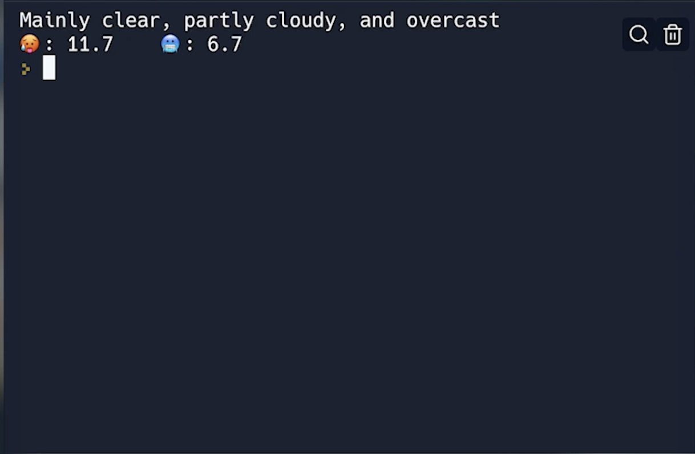

# 👉 Day 92 Challenge

Today's challenge is to create your own weather app.

👉 To start you off, we've found a free weather API, so here's the starter code for that.  All you need to do is customize your timezone, longitude and latitude.  This code gets the max & min temperature and weather code.

```python
import requests, json
timezone = "GMT"
latitude = 51.5002
longitude = -0.1262

result = requests.get(f"https://api.open-meteo.com/v1/forecast?latitude={latitude}&longitude={longitude}&daily=weathercode,temperature_2m_max,temperature_2m_min&timezone={timezone.upper()}")

user = result.json()
print(json.dumps(user, indent=2))
```
Your weather app should:

1. Get the weather for your local area.
2. Output the forecast for today. It should show (in a really nice way):
    1. The text version of what the weather code means.
    2. Max & min temperatures.
  
Example:


<details> <summary> 💡 Hints </summary>
  
- Get the longitude & latitude for your nearest city.
- Smash out a massive `if ... elif...else` selection statement.
- Use Boolean operators (and, or, not) to check for more than one weather code in the same `elif`, eg: `elif code==1 or code==2 or code==3:`

</details>